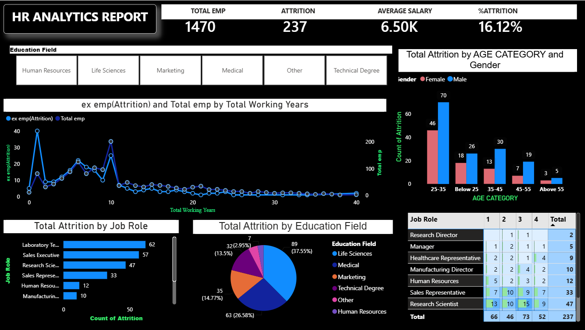

# 📊 HR Analytics Dashboard | Power BI

An interactive HR Analytics Dashboard built using Power BI to analyze employee attrition, workforce distribution, salary trends, and employee demographics. The dashboard provides HR teams with actionable insights for better workforce management.

---

## 📌 Project Overview

This project focuses on analyzing employee data to identify attrition trends across departments, education fields, age groups, and job roles. Interactive filters allow users to explore HR metrics efficiently.

---

## 🚀 Features

- Employee Attrition Analysis
- Interactive KPI Cards
- Department & Job Role Analysis
- Education Field Analysis
- Age-wise Attrition Analysis
- Salary & Workforce Insights
- Interactive Slicers

---

## 🛠️ Tools & Technologies

- Power BI
- Power Query
- DAX
- Data Modeling
- Data Visualization

---

## 📊 Dashboard Preview



---

## 📂 Project Structure

```
📁 HR-Analytics-Dashboard
│── HR_Analytics.pbix
│── README.md
│── HR_Dashboard.png
│── HR_Data.xlsx
```

---

## 📈 Key Insights

- Analyzed employee attrition across job roles and education fields.
- Identified the age groups with the highest attrition.
- Built interactive KPI cards for workforce metrics.
- Created dynamic reports using DAX and Power BI visuals.


**Rachna Patel**

Aspiring Data Analyst | Power BI | Excel | Python | SQL
